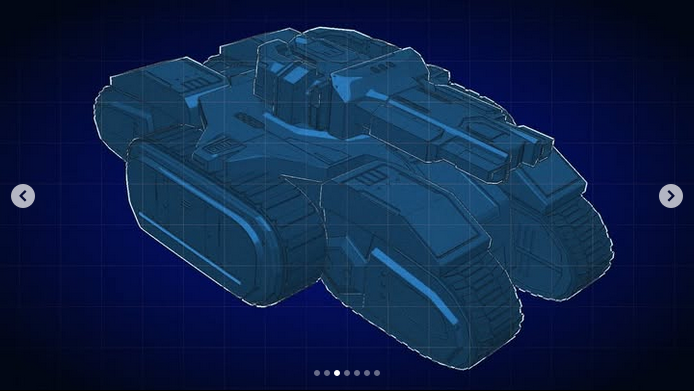
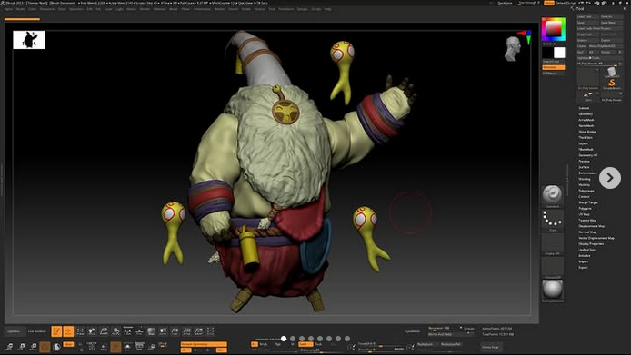
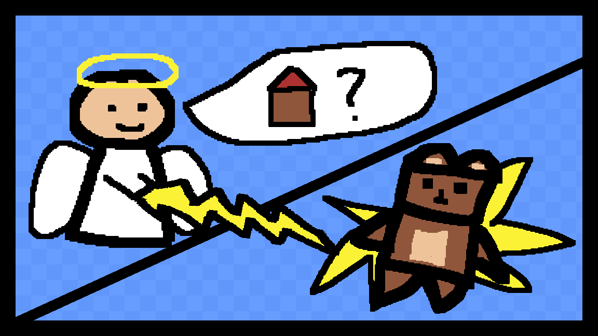
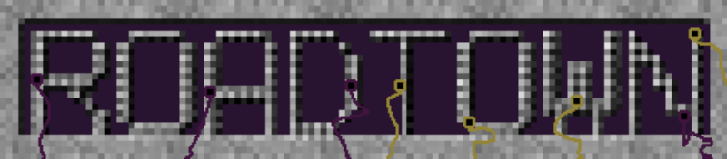
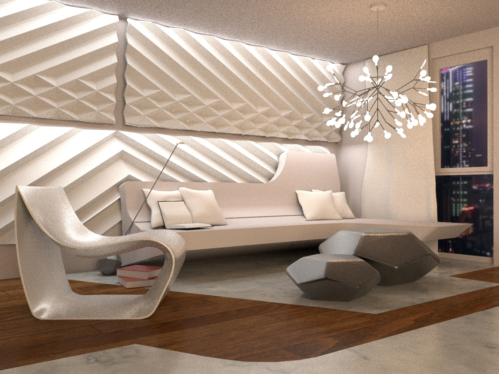
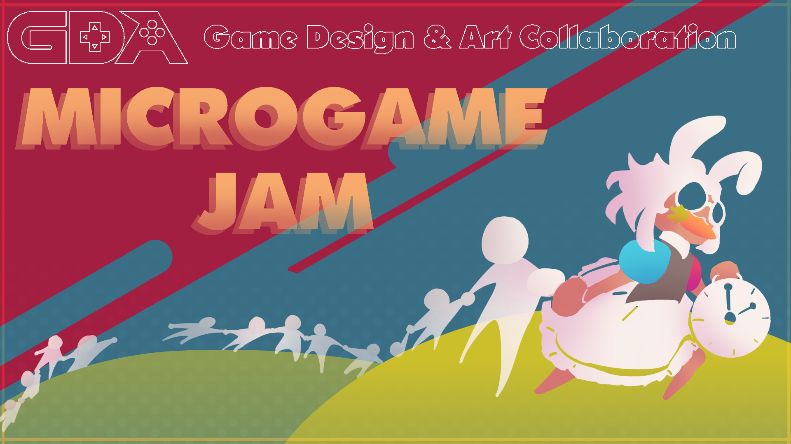
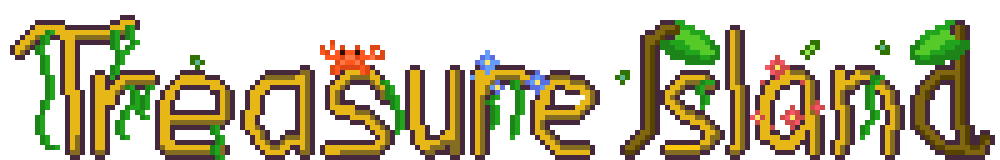
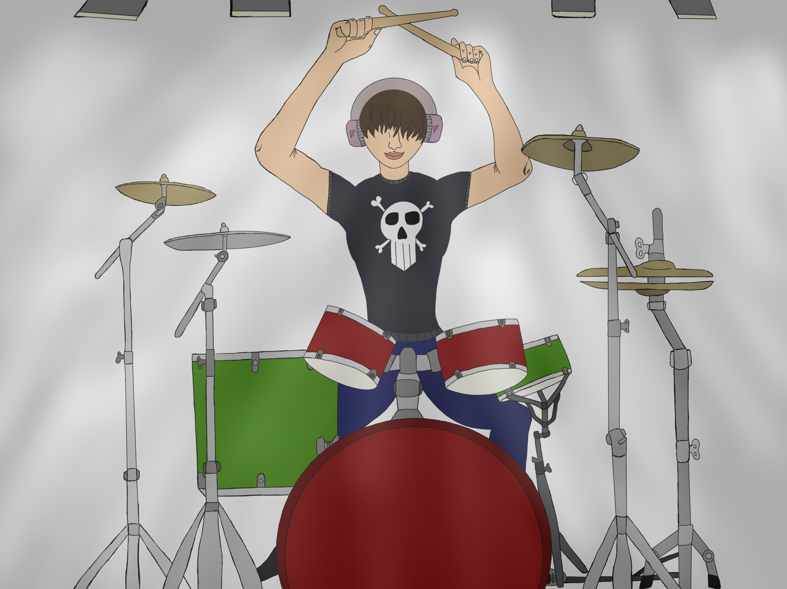

<h1 align="center">Thomas Noell's Projects!</h1>

<h2>
  <strong>Seige Tank Fan Model</strong> · <em>July 2023 - September 2023</em> · 
  <a href="https://github.com/OfficialThomas/ZbrushBardLoL">GitHub Repo</a>
</h2>

  

<h2>
  <strong>Bard Fan Model</strong> · <em>July 2023 - September 2023</em> · 
  <a href="https://github.com/OfficialThomas/ZbrushBardLoL">GitHub Repo</a>
</h2>

  

<h2>
  <strong>Bouncy Bear</strong> · <em>March 2023 - June 2023</em> · 
  <a href="https://officialthomas.itch.io/bouncybear">Play on Itch.io</a> ·
  <a href="https://github.com/OfficialThomas/Bouncy-Bear-Game">GitHub Repo</a>
</h2>

> - Roles: Creator

  

<h2>
  <strong>RoadTown</strong> · <em>January 2023 - March 2023</em> · 
  <a href="https://officialthomas.itch.io/roadtown-usa">Play on Itch.io</a> ·
  <a href="https://github.com/OfficialThomas/CMPM-171-GROUP-20">GitHub Repo</a>
</h2>

> - Roles: Programmer, Co-Designer, Producer

  

<h2>
  <strong>"Sci-fi" Furniture Scene</strong> · <em>July 2022 - September 2022</em> · 
  <a href="https://github.com/OfficialThomas/MayaScifiScene">GitHub Repo</a>
</h2>

  

<h2>
  <strong>Happy Hunting</strong> · <em>September 2021</em> · 
  <a href="https://jonahrobot.itch.io/happyhunting">Play on Itch.io</a> ·
  <a href="https://github.com/OfficialThomas/HappyHunting">GitHub Repo</a> · 
  <a href="https://itch.io/jam/microgame-jam-2021">Game Jam</a>
</h2>

> - Roles: Programmer, Designer

  

<h2>
  <strong>Treasure Island</strong> · <em>July 2021 - Aug 2021</em> · 
  <a href="https://officialthomas.github.io/Treasure-Island/">Play on Github Pages</a> ·
  <a href="https://github.com/OfficialThomas/Treasure-Island">GitHub Repo</a> 
</h2>

> - Roles: Programmer, Designer

  

<h2>
  <strong>Stage Fright</strong> · <em>June 2021 - July 2021</em> · 
  <a href="https://officialthomas.github.io/Stage-Fright/">Play on Github Pages</a> ·
  <a href="https://github.com/OfficialThomas/Stage-Fright?tab=readme-ov-file">GitHub Repo</a> 
</h2>

> - Roles: Programmer, Designer

  

